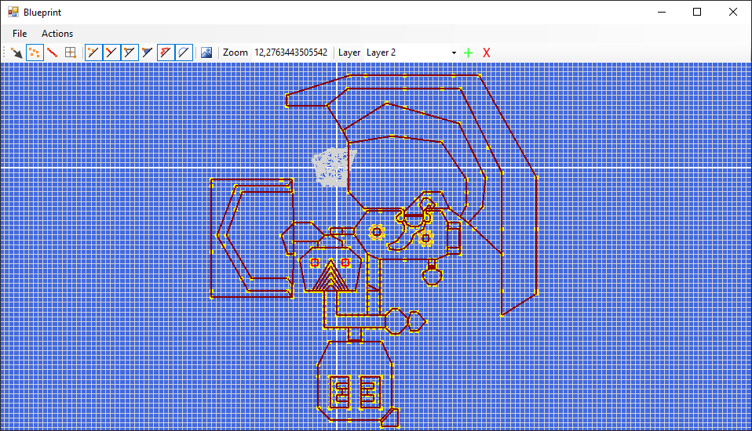

# README #

This README would normally document whatever steps are necessary to get your application up and running.

### What is this repository for? ###

Blueprint, a tool to draw and visualize simple 2D geometry.
It was never optimized to display a lot of geometry.
It is able to import WKT
It is able to import classic DOOM .WAD files (it is not a map editor by any means!)

### How do I get set up? ###

*Windows*
Open the solution with Visual Studio. This should work in VS community 2017.
With a default dektop install everything should work out of the box as it just uses winforms.

*Linux*
Ununtu 14.04 LTS: 
apt-get gets the old one that does not work, you should follow the install procedure from mono itself, found here:
http://www.mono-project.com/docs/getting-started/install/linux/

Ubuntu 16.04 LTS: Untested.

The solution file can be opened from MONO Develop.
Also the solution can be build on the command line via xbuild:
~~~~
xbuild Blueprint.sln
~~~~

### Who do I talk to? ###

www.necrosoft.nl

### Licence ###

There is no licence, use the source code or program for whatever you want... but changed are appriceated.
